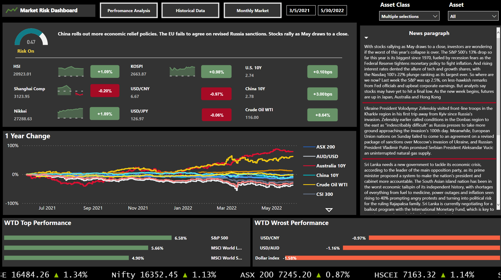
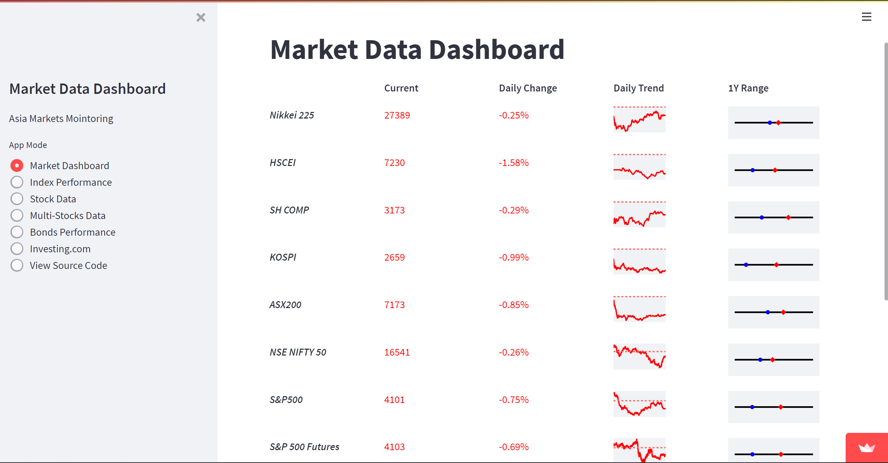
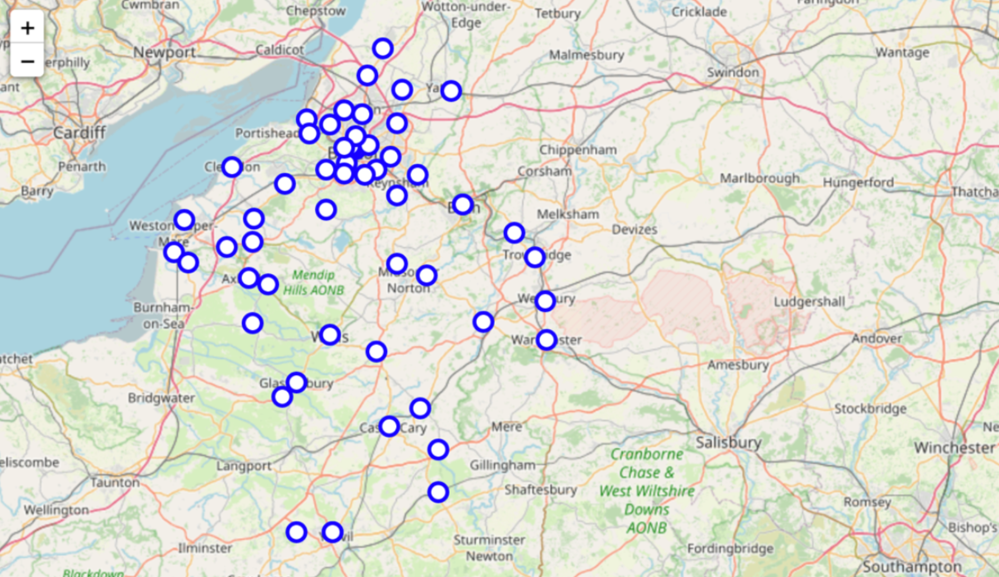
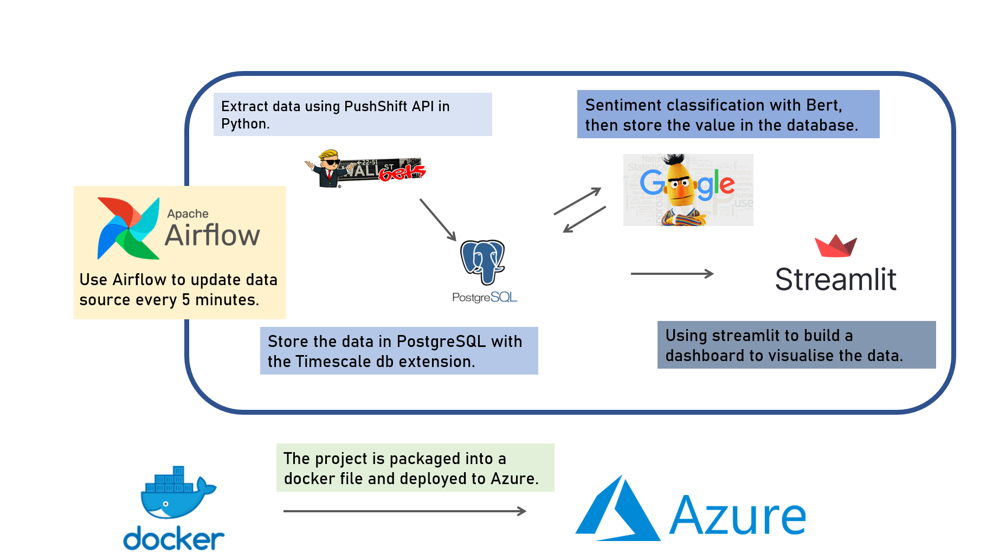

# Alan's Portfolio Page

## Last updated: 6th June 2022
# 🔧 **This page is undergoing some major updates, please stay tuned for the daily updates.**  🔧

# **About Me**

**tldr:** Data science enthusiast with a **strong background** in the **financial market** (particularly in risk). Have extensive experience working on various **dashboard building**, **data pipeline building** and **machine learning projects** between my work experience and personal projects.

**Programming language:** Python, SQL, Power Query M, Power BI DAX

**Technologies**: [Azure cloud](https://www.credly.com/badges/b69a5b3d-8eb6-40b0-97f8-04b25f5864bb), Docker, Git, Apache Airflow, Apache Spark, Streamlit, Dash,  Basic Linux and Windows command line. 

**Other technologies:** Bloomberg terminal, Microsoft Office Suite

**More on licenses & certifications:** [My LinkedIn Page](https://www.linkedin.com/in/alanwth/details/certifications/)

 

---

 

I am originally from Hong Kong and have spent most of my teenage life studying in the UK. After completing my **Economics** degree at Bristol, I pursued a **Computer Science** master’s degree at the University of Bath. Since then, I have been working hard towards a **Data Science career** by pursuing data analytics roles in various companies. I have extensive experience **setting up data pipelines (ETL or ELT pipelines)**, dashboard building (with **Python or Power BI)**, statistical analysis and optimizing machine learning models.

Currently, I am a Data Analytics Research Assistant for the HKUST Fintech research project. I work on in-house and [commercial collaborative projects](https://bm.hkust.edu.hk/en-us/media-resources/overview/publications/reports/issue:8/) on a daily basis and have experience working with less tech-savvy audiences. I firmly believe that effectively communicating **data insight** to stakeholders is one of the most important qualities for a data scientist.

Since most of my projects are not open source, I decided it would be good to set up a personal portfolio to demonstrate my software development and data science abilities. 🔧 **As of May 2022, I am updating my portfolio daily and plan to do so in the foreseeable future.** 🔧

There are quite a few things I am passionate about, and Data Science is just one facet of my life. In my leisure time I love to play badminton, squash and snooker and watch sports such as football (Borussia Dortmund) and basketball (Warriors).

 

---

 

# **Past projects**

## **Deep Reinforcement learning**

🦖**Playing the Google Chrome T-Rex Game with Deep Q-learning** 🌵

Training a reinforcement learning agent to play the Google Chrome dinosaur game at a super human level.

[Repo](https://github.com/alanwong626/Deep-RL-Trex-Game)

[Document](https://github.com/alanwong626/Deep-RL-Trex-Game/blob/master/Research%20Paper.pdf)

[Demo](https://www.youtube.com/watch?v=Lejfa8nLR2o&feature=youtu.be) 

[Video Presentation](https://www.youtube.com/watch?v=BJyg9D8vsCk&feature=youtu.be)

**Project Keywords:** Reinforcement learning, Deep Q-learning

 

## **Power BI dashboards**

📈**Market dashboard**📉

This dashboard is an approximate replicate of one of the many dashboards I built at work. I aimed to visualize all the important market information in a single dashboard while allowing us to generate charts for daily reporting purposes quickly.

[Documentation](https://github.com/alanwong626/Stock-Market-PowerBI)

[Video Demo](https://www.youtube.com/watch?v=rMdJvjt3hBs)

[Photo Demo](https://github.com/alanwong626/Stock-Market-PowerBI/blob/main/demo/Photo%20demo/Dashboard%20Snapshots.pdf)

**Project Keywords:** Power BI, Business Intelligence, Visualization, Power BI DAX Lanauage

 

## **Python Data dashboard**

📈**Streamlit dashboard - A Streamlit dashboard for financial market**📉

While I have had extensive experience using APIs to collect market data, some of my previous colleagues are less familiar with the topic. To increase efficiency of the team, I would like to offer my expertise. This dashboard is built on Streamlit, and users can download market data with a click of a button and obtain quick visualizations for their reports!

[Repo](https://github.com/alanwong626/market-monitoring)

[Go to the website](https://share.streamlit.io/alanwong626/market-monitoring/main/app.py)

**Project Keywords:** Power BI, Business Intelligence, Visualization, Power BI DAX Lanauage

 

## **Unsupervised learning**

🍻 **IBM capstone - Answering a business question, where to set up a pub in the Bath and Bristol Area** 🍻

Studying in the UK was fun! What if I were to stay there and open a pub near where I spent my teenage life? Let’s use machine learning to help us identify where we should open our pubs!

<!---  [Repo](https://github.com/alanwong626/Coursera_Capstone) -->

[Written Report](https://github.com/alanwong626/Coursera_Capstone/blob/main/IBM%20capstone%20week%202.pdf)

[Presentation](https://github.com/alanwong626/Coursera_Capstone/blob/main/Presentation%20(IBM%20captstone).pdf)

**Project Keywords:** Market data, API call, Yahoo Finance, Investing.com, Visualization

 

---

 

# **Work in progress**

## 🚧 **End-to-end data science project 1** 🚧

**From research to deployment - Reddit sentiment dashboard** 

**Language used:** Python, SQL (PostgreSQL)

**Software used:** Microsoft Azure, Docker (Docker Compose), Apache Airflow, NLTK, Scikit-learn, Streamlit, PushShift API

**tldr:** End to end data science project from preliminary studies to building a dashboard pipeline to deployment in Azure

[Repo](https://github.com/alanwong626/yelp-dataset)

Report

Demo

**Project Keywords:** K-means, clustering algorithm

 

**Project keywords:** Azure, cloud, Python, Natural Lanauage Processing, Dashboard, MLOps, Apache Airflow

## 🚧 **End-to-end data science project 2**🚧

**Yelp review recommendation system - Sentiment Analysis and unsupervised learning** 

**Language used:** Python, SQL (PostgreSQL)

**Software used:** Microsoft Azure, Docker (Docker Compose), PySpark

**tldr:** End to end data science project from preliminary studies to building a dashboard pipeline to deployment in Azure

[Repo](https://github.com/alanwong626/reddit)

Report

Demo

[EDA Chart](img/EDA%20visual.html)

## **Other machine learning related content**

🏛️Medium article - Vertical federated learning blog post (TBC)🏛️

## **Power BI dashboard**
Survival analysis
Demo
Documentation
